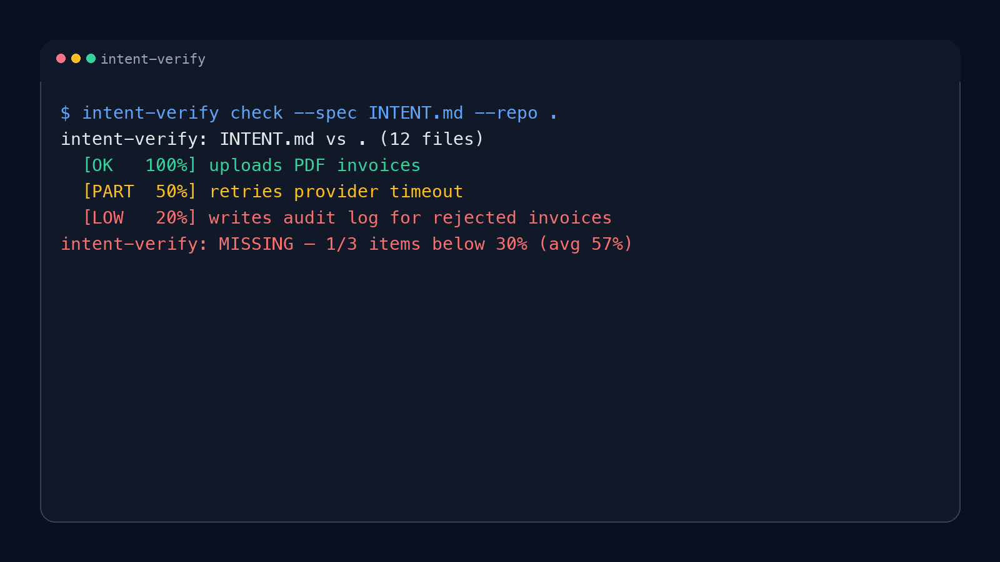

# intent-verify: repo intent verification and spec drift checks

Find spec drift fast when your repo has an `INTENT.md`, `SPEC.md`, or handoff doc but nobody knows if the code still matches it.

`intent-verify` checks a markdown spec against a repo and returns `verified`, `partial`, or `missing` so you can catch repo intent drift before review, release, or handoff.

- "My repo has an `INTENT.md` but nobody knows if the code still matches it."
- "Reviews catch scope drift too late."
- "A handoff doc says one thing and the implementation says another."
- "I want a cheap CI check for spec drift before merge."
- "We need repo intent verification without inventing another full compliance system."

Fastest install:

```bash
pip install intent-verify
```

Fastest real usage:

```bash
intent-verify check --spec INTENT.md --repo .
```

Exact outcome:

```text
intent-verify: INTENT.md vs . (12 files)
  [OK   100%] uploads PDF invoices
  [PART  50%] retries provider timeout
  [LOW   20%] writes audit log for rejected invoices
intent-verify: MISSING — 1/3 items below 30% (avg 57%)
```



This is a guardrail, not proof of correctness. It answers “does the implementation visibly cover the stated scope?” not “is the software correct?”

## Install

```bash
pip install intent-verify
```

For local development:

```bash
pip install -e ".[dev]"
```

## Common search-intent use cases

- repo intent verification
- spec drift check
- handoff verification
- acceptance criteria drift detection
- CI check for markdown spec vs code

## Usage

```bash
intent-verify check --spec INTENT.md --repo .
intent-verify check --spec SPEC.md --repo . --json
intent-verify check --spec docs/handoff.md --repo src --min-verified 0.75 --min-item 0.35
```

## What it parses

By default it extracts items from:

- inline lines such as `Accepts: upload PDF invoices, retry on timeout`
- markdown sections such as `## Accepts` with bullet items

It also supports custom headings:

```bash
intent-verify check --spec SPEC.md --section "Requirements"
```

## Output

```text
intent-verify: INTENT.md vs . (12 files)
  [OK   100%] uploads PDF invoices
  [PART  50%] retries provider timeout
  [LOW   20%] writes audit log for rejected invoices
intent-verify: MISSING — 1/3 items below 35% (avg 57%)
```

JSON mode:

```bash
intent-verify check --spec INTENT.md --repo . --json
```

## Limitations

- Lexical, not semantic.
- Can over-credit token overlap.
- Can under-credit implementations expressed with different vocabulary.
- Best used as a CI guardrail or review hint, not as a substitute for tests and code review.

## When To Use It

- You keep project intent in markdown.
- You want a lightweight repo intent verification step in CI.
- You need a handoff verification check before merging or releasing.

## When Not To Use It

- You need semantic verification of behavior.
- You do not have any human-readable spec, intent, or requirements file.
- You want proof of correctness instead of a fast drift signal.

## Development

```bash
ruff check .
python3 -m pytest -q
python3 -m py_compile src/intent_verify/*.py
```

## Repository layout

```text
src/intent_verify/
tests/
examples/
```

---

## About Hermes Labs

[Hermes Labs](https://hermes-labs.ai) builds AI audit infrastructure for enterprise AI systems — EU AI Act readiness, ISO 42001 evidence bundles, continuous compliance monitoring, agent-level risk testing. We work with teams shipping AI into regulated environments.

**Our OSS philosophy — read this if you're deciding whether to depend on us:**

- **Everything we release is free, forever.** MIT or Apache-2.0. No "open core," no SaaS tier upsell, no paid version with the features you actually need. You can run this repo commercially, without talking to us.
- **We open-source our own infrastructure.** The tools we release are what Hermes Labs uses internally — we don't publish demo code, we publish production code.
- **We sell audit work, not licenses.** If you want an ANNEX-IV pack, an ISO 42001 evidence bundle, gap analysis against the EU AI Act, or agent-level red-teaming delivered as a report, that's at [hermes-labs.ai](https://hermes-labs.ai). If you just want the code to run it yourself, it's right here.

**The Hermes Labs OSS audit stack** (public, production-grade, no SaaS):

**Static audit** (before deployment)
- [**lintlang**](https://github.com/hermes-labs-ai/lintlang) — Static linter for AI agent configs, tool descriptions, system prompts. `pip install lintlang`
- [**rule-audit**](https://github.com/hermes-labs-ai/rule-audit) — Static prompt audit — contradictions, coverage gaps, priority ambiguities
- [**scaffold-lint**](https://github.com/hermes-labs-ai/scaffold-lint) — Scaffold budget + technique stacking. `pip install scaffold-lint`

**Runtime observability** (while the agent runs)
- [**little-canary**](https://github.com/hermes-labs-ai/little-canary) — Prompt injection detection via sacrificial canary-model probes
- [**suy-sideguy**](https://github.com/hermes-labs-ai/suy-sideguy) — Runtime policy guard — user-space enforcement + forensic reports
- [**colony-probe**](https://github.com/hermes-labs-ai/colony-probe) — Prompt confidentiality audit — detects system-prompt reconstruction

**Regression & scoring** (to prove what changed)
- [**hermes-jailbench**](https://github.com/hermes-labs-ai/hermes-jailbench) — Jailbreak regression benchmark. `pip install hermes-jailbench`
- [**agent-convergence-scorer**](https://github.com/hermes-labs-ai/agent-convergence-scorer) — Score how similar N agent outputs are. `pip install agent-convergence-scorer`

**Supporting infra**
- [**claude-router**](https://github.com/hermes-labs-ai/claude-router) · [**zer0dex**](https://github.com/hermes-labs-ai/zer0dex) · [**forgetted**](https://github.com/hermes-labs-ai/forgetted) · [**quick-gate-python**](https://github.com/hermes-labs-ai/quick-gate-python) · [**quick-gate-js**](https://github.com/hermes-labs-ai/quick-gate-js) · [**repo-audit**](https://github.com/hermes-labs-ai/repo-audit)
