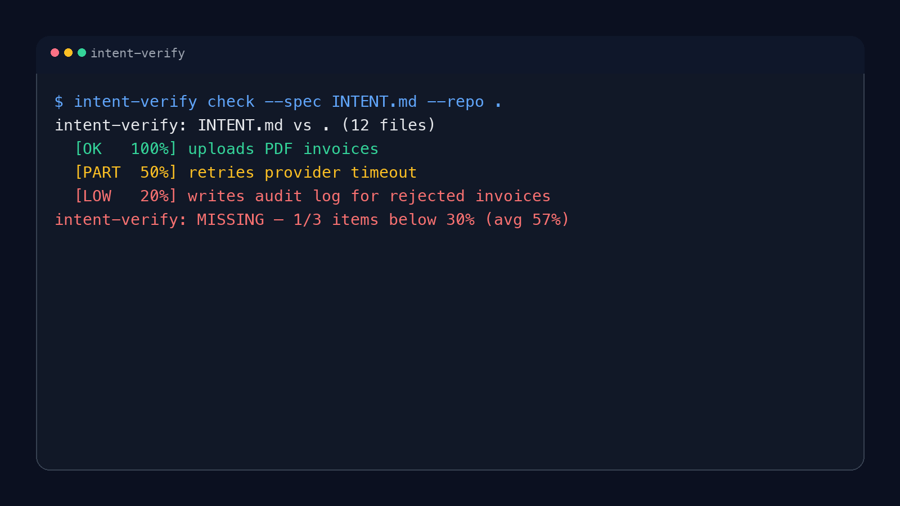

# intent-verify

[](https://github.com/hermes-labs-ai/intent-verify/actions/workflows/ci.yml)
[](https://pypi.org/project/intent-verify/)
[](LICENSE)

intent-verify deterministically checks whether a repository still lexically covers the acceptance items in a Markdown spec before human review.

intent-verify is developed by [Hermes Labs](https://hermes-labs.ai).

Hermes Labs studies failure modes in agent and LLM systems, develops open-source tools that treat language as part of the runtime, and works with teams to remediate reliability failures in production.

Give it an `INTENT.md`, `SPEC.md`, requirements list, or handoff document, and it reports whether the selected repository evidence visibly uses the same terms.

Use `check` for a repository-wide signal, or `map` when you need each
acceptance item tied to explicit source and test roots. A gap can stop a claim
that scope is covered. A covered result sends work to review; it never
authorizes acceptance, merge, release, or publication.

`INTENT.md` is an input-file example, not an integration point. Claude Code's
project-instruction documentation describes `CLAUDE.md` and `AGENTS.md`; this
tool does not load either automatically and only reads the file passed to
`--spec`. See Anthropic's [project memory documentation](https://code.claude.com/docs/en/memory)
for how Claude Code handles those instruction files.

## How it works

intent-verify is intentionally simple and fully deterministic — no model, no network:

1. Parse acceptance items from the spec (inline `Accepts:`/`Requirements:`/`Scope:` lines and bullet/numbered lists under matching headings).
2. Tokenize each item, dropping common stop words.
3. For each item, compute the fraction of its tokens that appear as substrings in the selected evidence files (the spec file itself is excluded).
4. Score each item against two thresholds and roll up to a single verdict.

Coverage is a lexical token-overlap signal, not a semantic judgment.

## Orchestration coverage map

Name implementation evidence explicitly. This prevents a matching README
elsewhere in the repository from satisfying the map:

```bash
intent-verify map \
  --spec INTENT.md \
  --repo . \
  --evidence-path src \
  --evidence-path tests
```

The command emits only JSON using the versioned
`intent-verify.coverage-map.v1` contract. Each item includes the files that
contributed matching terms. The top-level `acceptance_authority` is always
`false`; `decision` is `review` for covered scope and `inspect` for partial or
gap results.

| Map verdict | Exit | Orchestration meaning |
| --- | ---: | --- |
| `covered` | `0` | Continue to tests and review; do not accept automatically. |
| `partial` | `1` | Inspect the weak items before claiming scope coverage. |
| `gap` | `2` | Stop the scope-covered claim and inspect missing evidence. |

### GitHub Action

The root composite Action applies the same contract. A workflow can use the
versioned `v0.2.1` tag:

```yaml
- name: Map intent to changed implementation surfaces
  uses: hermes-labs-ai/intent-verify@v0.2.1
  with:
    spec: INTENT.md
    repo: .
    evidence-paths: |
      src
      tests
    summary: true # optional; defaults to false
```

After the `v0.2.1` tag is published, resolve it to its commit SHA when your
supply-chain policy requires a full commit pin.

Upload the path returned by the Action's `receipt` output when the JSON should
remain as a build artifact.

Set `summary: true` to add a bounded, escaped advisory coverage table to the
GitHub Actions job summary. It includes the caller's spec path and acceptance
item labels, so leave it off when those labels are sensitive. The summary does
not grant acceptance authority: it reports lexical evidence only; review,
tests, and human judgment still decide correctness and merge readiness. The
`summary-written` output reports whether the requested summary was rendered.

The repository retains `.zenodo.json` as passive metadata. Its listed DOI is a
reference to the associated paper, not a software identity; Zenodo archiving is
not a release prerequisite or a promised release side effect.

### Agent plugin (Claude Code, Codex CLI, Gemini CLI)

The repository root is one portable Agent Plugin (`plugin.json`, Agent Plugins
1.0.0) with a single skill, `skills/intent-verify/SKILL.md`. Each host installs
that same skill with its own native command; none of them gets a separate copy.

| Host | Install | Read back |
| --- | --- | --- |
| Claude Code | `claude plugin marketplace add hermes-labs-ai/intent-verify`<br>`claude plugin install intent-verify@intent-verify` | `claude plugin list` |
| OpenAI Codex CLI | `codex plugin marketplace add hermes-labs-ai/intent-verify`<br>`codex plugin add intent-verify@intent-verify` | `codex plugin list` |
| Gemini CLI | `gemini extensions install https://github.com/hermes-labs-ai/intent-verify --ref v0.2.1` | `gemini skills list` |
| skills.sh | `npx skills add https://github.com/hermes-labs-ai/intent-verify#v0.2.1 --skill intent-verify` | `npx skills list` |

What each host reads:

- Claude Code reads `.claude-plugin/marketplace.json` (its entry is `.`, the
  root) and `.claude-plugin/plugin.json`.
- Codex reads the repo marketplace `.agents/plugins/marketplace.json` (its
  entry is `./`, the root) and the portable `plugin.json`.
- Gemini CLI reads `gemini-extension.json` and discovers the skill under
  `skills/`. Keep `--ref v0.2.1` so installation resolves the reviewed semantic
  release rather than a mutable branch.

The skill uses an installed `intent-verify` CLI, or the pinned
`uvx intent-verify==0.2.1` with your agreement.

In Claude Code the plugin also adds two on-demand commands. Use
`/intent-verify:check --spec INTENT.md --repo .` for a normal coverage check,
or `/intent-verify:map --spec INTENT.md --repo . --evidence-path src` to emit a
provenance map for explicit implementation roots. Both commands use the local
`intent-verify` CLI and run only when you invoke them. Their results remain
advisory lexical evidence: `covered` and `verified` do not authorize
acceptance, merge, release, or publication.

## Install

```bash
pip install intent-verify
```

Or install the CLI from the [Hermes Labs Homebrew tap](https://github.com/hermes-labs-ai/homebrew-tap):

```bash
brew install hermes-labs-ai/tap/intent-verify
```

For local development:

```bash
pip install -e ".[dev]"
```

## 60-second quickstart

Given a spec like:

```markdown
# Intent

## Accepts
- uploads PDF invoices
- retries provider timeout
```

run:

```bash
intent-verify check --spec INTENT.md --repo .
```

You get a per-item breakdown and a single verdict:

```text
intent-verify: INTENT.md vs . (12 files)
  [OK   100%] uploads PDF invoices
  [PART  50%] retries provider timeout
  [LOW   20%] writes audit log for rejected invoices
intent-verify: MISSING — 1/3 items below 30% (avg 57%)
```

(The file count, percentages, and items above are illustrative — your numbers depend on your spec and repo.)

The exit code mirrors the verdict, so it drops straight into CI or a pre-commit hook:

| Verdict | Meaning | Exit code |
| --- | --- | --- |
| `verified` | every parsed item cleared the verified threshold | `0` |
| `partial` | at least one item is only partly covered | `1` |
| `missing` | at least one item fell below the per-item minimum | `2` |



## Usage

```bash
intent-verify check --spec INTENT.md --repo .
intent-verify check --spec SPEC.md --repo . --json
intent-verify check --spec docs/handoff.md --repo src --min-verified 0.75 --min-item 0.35
```

Flags:

- `--spec` — path to the markdown spec, intent, or handoff file (required).
- `--repo` — path to the repo or source tree to scan (required).
- `--section` — target a specific markdown heading, for example `Requirements`.
- `--json` — emit machine-readable JSON instead of text.
- `--min-verified` — coverage an item must clear to count as verified (default `0.7`).
- `--min-item` — minimum per-item coverage before an item is treated as missing (default `0.3`).

### What it parses

By default it extracts items from:

- inline lines such as `Accepts: upload PDF invoices, retry on timeout`
- markdown sections such as `## Accepts` with bullet or numbered items (`Accepts`, `Requirements`, `Scope` headings, or a custom one via `--section`)

### JSON output

```bash
intent-verify check --spec INTENT.md --repo . --json
```

The JSON object includes `spec_path`, `repo_path`, `files_scanned`,
`average_coverage`, `verdict`, the thresholds used, and an `items[]` array with
each item's parsed text, tokens, coverage, verdict, and contributing evidence
paths. Legacy `check` output remains compatible and now includes the explicit
non-authority metadata.

## Limitations / what it does NOT do

- **Not runtime agent intent verification.** It does not authorize or monitor AI-agent actions, MCP/tool calls, or permissions; it checks static repository source against a markdown spec.
- **Lexical, not semantic.** It matches tokens as substrings; it does not understand meaning, control flow, or behavior.
- **It can over-credit.** A token appearing anywhere in any scanned file counts, even if it is in a comment, a string, or an unrelated context.
- **It can under-credit.** A correct implementation written with different vocabulary than the spec will score low.
- **It is not proof of correctness** and does not replace tests or code review. It answers "does the implementation visibly cover the stated scope?" — not "is the software correct?"
- **It needs a human-readable spec.** With no `INTENT.md`/`SPEC.md`/requirements/handoff file there is nothing to check against.
- **Source-file scope only.** It scans a fixed set of source extensions (Python, JS/TS, Go, Rust, shell, config, markdown, etc.) and skips common build/vendor directories.
- **Evidence paths are not behavioral proof.** `map` prevents unrelated paths
  from contributing, but comments, docstrings, and dead code inside selected
  paths can still match. Tests and review remain authoritative.

## Development

```bash
ruff check .
python3 -m pytest -q
python3 -m py_compile src/intent_verify/*.py
```

## Repository layout

```text
src/intent_verify/
tests/
examples/
skills/intent-verify/SKILL.md   canonical agent skill
commands/                       Claude Code slash commands
plugin.json                     portable Agent Plugins 1.0.0 manifest
.claude-plugin/                 Claude Code plugin + marketplace
.agents/plugins/marketplace.json Codex CLI marketplace
gemini-extension.json           Gemini CLI extension
```

---

Part of the [Hermes Labs reliability stack](https://github.com/hermes-labs-ai). Complementary siblings, not duplicates: [rule-audit](https://github.com/hermes-labs-ai/rule-audit) analyzes logical contradictions in system prompts, and [lintlang](https://github.com/hermes-labs-ai/lintlang) lints agent-config structure — intent-verify instead checks spec-vs-code drift.

## About Hermes Labs

Hermes Labs studies failure modes in agent and LLM systems, develops open-source tools that treat language as part of the runtime, and works with teams to remediate reliability failures in production.

Browse the [open-source catalog](https://hermes-labs.ai/open-source) or contact [roli@hermes-labs.ai](mailto:roli@hermes-labs.ai).
